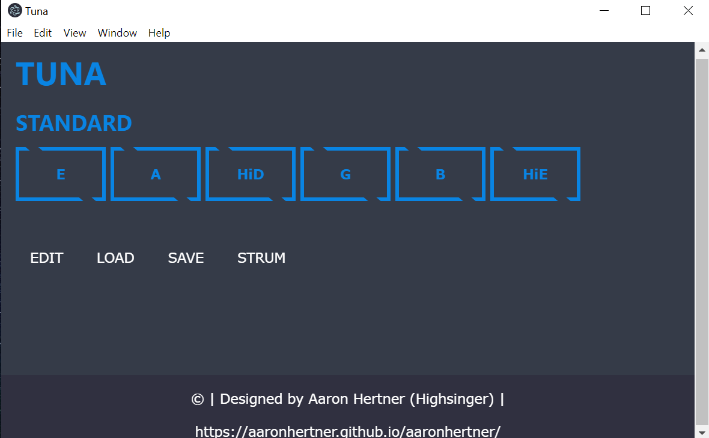

		
# Author    
Aaron Hertner		
30/12/2019		
https://aaronhertner.github.io/aaronhertner/		

# How To Use
- run 'npm install' to install all dependencies
- to run navigate to the project directory and run 'npm start'
	-> or run 'npm run package-win' and then navigate to '/release_builds'
	-> from here run 'Tuna.exe' as normal
- tunings should be saved to the empty tuning directory so they can be loaded
  later
- to add new tones you must download a new .wav file, and set up an audio object
  in /pages/page.js
- click the buttons to hear the tones
